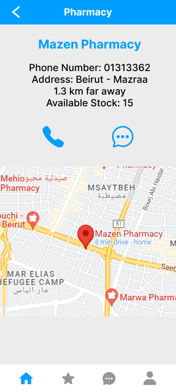

<div align="center">

> PharmaLeb, an app that helps securing medical drugs in Lebanon.

**[PROJECT PHILOSOPHY](#philosophy) • [WIREFRAMES](#wireframes) • [TECH STACK](#tech) • [IMPLEMENTATION](#implementation) • [HOW TO RUN?](#install)**

</div>

<br><br>


> Are you suffering to find your medicine? PharmaLeb is a medicine tracking app right in the palm of your hands. It offers a direct connection between pharmacists and patients. Patients can easily find their needed medicine at the closest pharmacy. All it takes is three easy steps: search, find, and call.

# User Stories

> <b>Patient Stories</b>

-   As a patient, I want to search and find medicines without suffering.
-   As a patient, I like to bookmark some medicines as favorites in order to track their availability easily.
-   As a patient, I want to know how far each pharmacy is because time and transportation are important to me.
-   As a patient, I want to receive notifications to stay updated with the availability of my needed medicines.
-   As a patient, I want to get in touch with pharmacies through direct calls or text chatting to discuss medicine availability and delivery.
-   As a patient, I want to join a community of pharmacists and other patients to ask for certain medicines or medical needs when needed.

> <b>Pharmacist Stories</b>

-   As a pharmacist, I am an empathetic person who wants to help patients find their needs and overcome drug shortage by offering my stock medicines availability to public.
-   As a pharmacist, I want to register and set my pharmacy phone number and location on the map in order to be found by users.
-   As a pharmacist, I want to constantly update my medicine listings and item stock.
-   As a pharmacist, I need to get in touch with patients through phone calls and live chatting to discuss delivery and answer any questions they might have or to prescribe alternative drugs.

> <b>Admin Stories</b>

-   As an admin, I can access the admin panel where I can manage the medicine list within PharmaLeb app.
-   As an admin, I can add a medicine, delete a medicine, or update medicine data. Medicine data and pricing are taken from the Lebanese Ministry of Public Health.

<br><br>


> This design was first planned on paper moved to Figma for fine details.
> Note that no styling library or theme were used in the app or admin panel. All was done from scratch using pure react native components and Stylesheet objects (expect for Gifted Chat)

> <b>Patient</b>

<table style="width:100%">
  <tr>
    <th style="width:33%; text-align:center">Home/Search </th>
    <th style="width:33%; text-align:center">Medicine</th>
    <th style="width:33%; text-align:center">Pharmacy</th>
  </tr>
  <tr>
    <td style="width:33%; text-align:center"></td>
    <td style="width:33%; text-align:center"></td>
    <td style="width:33%; text-align:center"></td>
  </tr>
 <tr>
    <th style="width:33%; text-align:center">Favorites </th>
    <th style="width:33%; text-align:center">Chats</th>
    <th style="width:33%; text-align:center">Profile</th>
  </tr>
  <tr>
    <td style="width:33%; text-align:center"></td>
    <td style="width:33%; text-align:center"></td>
    <td style="width:33%; text-align:center"></td>
  </tr>
</table>

> <b>Pharmacist</b>

<table style="width:100%">
  <tr>
    <th style="width:33%; text-align:center">Manage Items</th>
    <th style="width:33%; text-align:center">Edit Stock</th>
    <th style="width:33%; text-align:center">Edit Pharmacy</th>
  </tr>
  <tr>
    <td style="width:33%; text-align:center"></td>
    <td style="width:33%; text-align:center"></td>
    <td style="width:33%; text-align:center"></td>
  </tr>
</table>

<br><br>


Here's a brief high-level overview of the tech stack PharmaLeb uses:

-   The app uses [React Native](https://reactnative.dev/) framework that combines the best parts of native development with React, a best-in-class JavaScript library for building user interfaces. It is developed with the help of [Expo CLI](https://expo.dev/).
-   For persistent data storage (database), the app uses [MongoDB](https://www.mongodb.com/), a NoSQL database.
-   For the backend server, the app uses [Node.js](https://nodejs.org/en/) with [Express](https://expressjs.com/) package to build a local server and deal with APIs.
-   To send push notifications, the app uses the expo notifications service [Expo Notifications](https://docs.expo.dev/versions/latest/sdk/notifications/#api).
    -   Note: Push notifications were tested locally within the development device.
-   For live text chatting service, the app uses [Firebase 9](https://firebase.google.com/) with the Cloud Firestore that helps dealing with real-time database updates.
-   The app uses [Google Maps API](https://mapsplatform.google.com/) integrated with React Native to display locations.
    -   Note: Due to the lack of a working Google Maps Platform billing account, directions and shortest path features could not be implemented using Google Maps API. Basic features of [React Native Maps](https://docs.expo.dev/versions/latest/sdk/map-view/) were used instead.
-   The admin panel was designed with [React](https://reactjs.org/), A JavaScript library for building user interfaces.

<br><br>


> Using the above mentioned tech stacks and wireframes built with figma from the user stories we have, the implementation of the app is shown as below.

<br></br>

# Here are some short animations (Gifs) from the real app:

## Patient Screens:

<table style="width:100%">
  <tr>
    <th style="width:33%; text-align:center">Search for Medicine </th>
    <th style="width:33%; text-align:center">Check Medicine</th>
    <th style="width:33%; text-align:center">Call Pharmacy</th>
  </tr>
  <tr>
    <td style="width:33%; text-align:center"></td>
    <td style="width:33%; text-align:center"></td>
    <td style="width:33%; text-align:center"></td>
  </tr>
 <tr>
    <td style="width:33%; text-align:center">The patient can search for a certain medicine. Search results are filtered in real-time. They can press on the medicine card to view details. </td>
    <td style="width:33%; text-align:center">Pharmacies selling each medicine are displayed with their availability stock of this medicine as well as their distance from the user.</td>
    <td style="width:33%; text-align:center">The app can directly navigate to the phone dialer to call the pharmacy. The patient also has the choice to start a live chat with the pharmacy.</td>
  </tr>
</table>

<table style="width:100%">
  <tr>
    <th style="width:33%; text-align:center">Add a Favorite</th>
    <th style="width:33%; text-align:center">Delete Favorites</th>
    <th style="width:33%; text-align:center">Edit Profile</th>
  </tr>
  <tr>
    <td style="width:33%; text-align:center"></td>
    <td style="width:33%; text-align:center"></td>
    <td style="width:33%; text-align:center"></td>
  </tr>
 <tr>
    <td style="width:33%; text-align:center">The patient can add a medicine to their favorite list in order to track it easily. </td>
    <td style="width:33%; text-align:center">The patient can also edit their favorites list by deleting medicines.</td>
    <td style="width:33%; text-align:center">Patients and pharmacists can edit their profile anytime. They can upload a profile picture.</td>
  </tr>
</table>

<table style="width:100%">
  <tr>
    <th style="width:33%; text-align:center">Community Chat</th>
    <th style="width:33%; text-align:center">Chat</th>
    <th style="width:33%; text-align:center">Notifications</th>
  </tr>
  <tr>
    <td style="width:33%; text-align:center"></td>
    <td style="width:33%; text-align:center"></td>
    <td style="width:33%; text-align:center"></td>
  </tr>
 <tr>
    <td style="width:33%; text-align:center">The community chat is where all patients and pharmacists can communicate with each other. It is an additional way to find medicines and request medical needs.</td>
    <td style="width:33%; text-align:center">One-to-one chat is another way of communication between a patient and a pharmacist. They can discuss availability, reservation, price, and delivery here.</td>
    <td style="width:33%; text-align:center">Patients receive push notifications when a medicine in their favorites list becomes available. It keeps patients always updated with their medical needs availability.</td>
  </tr>
</table>

## Pharmacist Screens:

<table style="width:100%">
  <tr>
    <th style="width:33%; text-align:center">Pharmacist Tabs</th>
    <th style="width:33%; text-align:center">Add a Medicine to Stock</th>
    <th style="width:33%; text-align:center">Edit Medicine Stock</th>
  </tr>
  <tr>
    <td style="width:33%; text-align:center"></td>
    <td style="width:33%; text-align:center"></td>
    <td style="width:33%; text-align:center"></td>
  </tr>
 <tr>
    <td style="width:33%; text-align:center">This is the pharmacist part of the app.</td>
    <td style="width:33%; text-align:center">Pharmacists can add any medicine to their available items from the predefined medicines database.</td>
    <td style="width:33%; text-align:center">Each pharmacist can edit the stock of their items whenever there are new arrivals or purchases.</td>
  </tr>
</table>

## Registration and Logging in:

<table style="width:100%">
  <tr>
    <th style="width:33%; text-align:center">Sign Up & Validation</th>
    <th style="width:33%; text-align:center">Login</th>
    <th style="width:33%; text-align:center">Register a Pharmacy</th>
  </tr>
  <tr>
    <td style="width:33%; text-align:center"></td>
    <td style="width:33%; text-align:center"></td>
    <td style="width:33%; text-align:center"></td>
  </tr>
 <tr>
    <td style="width:33%; text-align:center">Patients and pharmacists can register to PharmaLeb. There are validation rules to ensure secure and genuine data. Users are asked to set their location as it wil be used to calculate distances.</td>
    <td style="width:33%; text-align:center"> This is the opening app screen. Users can log in and they will be welcomed. The app will automatically direct each user type to their corresponding UI (patient or pharmacist).</td>
    <td style="width:33%; text-align:center"> After a pharmacist registers their account, they will be asked to register their pharmacy. Of course, pharmacy data should be valid and pharmacy location should be set.</td>
  </tr>
</table>

## Admin Panel:

<table style="width:100%">
  <tr>
    <th style="width:50%; text-align:center">Add a Medicine</th>
    <th style="width:50%; text-align:center">Edit/Delete a Medicine</th>
  </tr>
  <tr>
    <td style="width:50%; text-align:center"></td>
    <td style="width:50%; text-align:center"></td>
  </tr>
 <tr>
    <td style="width:33%; text-align:center">The admin can manage the medicine list displayed in the app. They can add a medicine with all its details.</td>
    <td style="width:33%; text-align:center">The admin can also edit an existing medicine data or delete the medicine completely from the database.</td>
  </tr>
</table>

<br><br>


> To get a local copy up and running follow these simple example steps.

### Prerequisites

<!-- This is an example of how to list things you need to use the software and how to install them. -->

-   Download and install Node.js LTS version (https://nodejs.org/en/)

-   npm
    ```sh
    npm install npm@latest -g
    ```
-   Install Expo CLI
    ```sh
    npm install --global expo-cli
    ```
-   Download Expo Go App on your smartphone:

> For Android: [Google Play Store](https://play.google.com/store/apps/details?id=host.exp.exponent).

> For iOS: [Apple App Store](https://apps.apple.com/us/app/expo-go/id982107779).

### Installation

1. Clone the repo

    ```sh
    git clone https://github.com/Zakaria-Takkoush/PharmaLeb.git
    ```

2. Navigate to the "client" folder and Install NPM packages

    ```sh
    npm install
    ```

3. Run the start up command

    ```sh
    expo start
    ```

4. Scan the generated QR code with your camera (iOS) or through the Expo Go application (Android)
